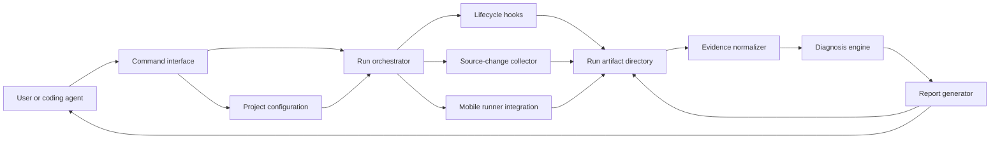

# MobTrace Engineering Proposal

Status: Proposed

## Purpose

This document proposes the initial engineering design for MobTrace.

It translates the product requirements in `docs/product/product.md` into a system
boundary and implementation approach. It does not define the final command
syntax, configuration schema, or report schema. Those are separate public
contracts to be designed after this proposal is accepted.

## Goals

The initial system should:

- run an existing mobile journey through an external test runner
- work with useful defaults before project-specific integration is added
- capture enough evidence to explain a failed journey
- correlate failure evidence with the current source change
- classify the likely failure area deterministically
- produce concise human-readable and machine-readable results
- preserve the underlying runner outcome
- support optional project setup and cleanup without embedding project logic
- remain usable locally without a hosted service

## Non-Goals

The initial system will not:

- implement its own mobile automation engine
- replace the external test runner
- discover or generate test journeys
- provide a general plugin framework
- require an AI model for diagnosis
- manage a remote service or persistent database
- support every mobile runner in the first release
- encode application-specific backend or fixture behavior in the core
- guarantee the true root cause of every failure

## Design Principles

### Useful Without Custom Integration

The default path should work for a project that already has a runnable mobile
journey. Custom setup, cleanup, and metadata must improve the result rather
than unlock basic use.

### External Tools Remain Authoritative

MobTrace coordinates existing tools. It must preserve their outputs and exit
status rather than reinterpret a failed run as success.

### Deterministic Diagnosis

Classification and ranking should be based on explicit rules and observable
evidence. The same inputs should produce the same result.

### Facts And Inferences Stay Separate

Reports should distinguish direct observations, such as a failed assertion,
from inferences, such as a changed file being suspicious.

### Project Logic Stays Outside The Core

Application-specific identity creation, backend preparation, and cleanup belong
to the consuming project. MobTrace should provide lifecycle boundaries for
those actions without understanding their domain.

### Failure Must Remain Inspectable

Raw evidence should be retained even when report generation or classification
is incomplete. A MobTrace processing failure must not erase the underlying
runner evidence.

## Proposed System Boundary

MobTrace owns:

- run orchestration
- lifecycle hook execution
- source-change capture
- test-runner invocation
- evidence discovery and normalization
- deterministic failure classification
- suspicious-change ranking
- report generation
- artifact retention

The consuming project owns:

- application source code
- mobile journeys
- build requirements not covered by defaults
- test accounts and fixture behavior
- backend availability
- project-specific setup and cleanup commands
- optional ownership metadata and known failure rules

The external mobile runner owns:

- device interaction
- journey execution
- assertions
- runner-specific screenshots, logs, hierarchy, and test results

## High-Level Architecture

## Component Responsibilities

### Command Interface

The command interface should:

- validate user intent and required inputs
- locate project configuration
- invoke the correct application service
- print a concise result
- return a stable process outcome

It should not contain runner logic, report parsing, or classification rules.

### Configuration Loader

The configuration loader should:

- discover configuration from the current project
- apply documented defaults
- validate all external values before execution
- resolve relative paths against a predictable project root
- reject unknown or unsafe combinations with actionable errors

Configuration should remain small. It should describe how MobTrace interacts
with a project, not become a programming language.

### Run Orchestrator

The orchestrator owns the run lifecycle:

1. validate the environment
2. create an isolated run directory
3. capture run metadata and source state
4. execute optional preparation
5. invoke the mobile runner
6. execute cleanup regardless of runner success
7. normalize retained evidence
8. generate diagnosis and reports
9. return the correct final outcome

The orchestrator should record each phase independently so infrastructure,
runner, cleanup, and reporting failures remain distinguishable.

### Lifecycle Hooks

Hooks provide an escape hatch for project-specific behavior.

Initial hook categories should be limited to:

- preparation before the journey
- cleanup after the journey

Hooks should:

- be optional
- execute as project-owned commands
- receive a small documented run context
- write output into the run evidence
- have explicit timeout and failure behavior
- run cleanup after both success and failure where possible

Hooks should not become an in-process plugin API in the initial design.

### Source-Change Collector

The source collector should capture:

- repository root
- current branch and revision
- working-tree status
- changed file list
- relevant diff content

Native source-control commands should remain the authority. The collector
should normalize their output for analysis without hiding the original diff.

The initial design may require a Git worktree. Support for other source-control
systems is outside the first release.

### Runner Integration

The first runner integration should target Maestro.

Its responsibility is to:

- verify that the runner is available
- invoke an existing journey
- preserve runner stdout, stderr, and exit status
- locate runner-generated evidence
- expose runner evidence through a normalized internal result

Runner-specific parsing must remain behind this boundary. Diagnosis and report
generation should consume normalized evidence rather than depend directly on
Maestro's directory layout.

The boundary should permit additional runners later, but the initial
implementation should not build a public plugin system or speculative generic
abstraction.

### Evidence Normalizer

The normalizer converts available run outputs into one internal evidence model.

Useful evidence may include:

- journey identity and status
- failed command or assertion
- failed selector
- failure message
- standard output and error output
- device logs
- screenshots
- view hierarchy
- structured test results
- hook outcomes
- source changes

Missing optional evidence should reduce diagnostic confidence, not crash report
generation. Missing mandatory runner evidence should be reported as a tool or
infrastructure failure.

### Diagnosis Engine

The diagnosis engine should be a deterministic pipeline:

1. identify the run outcome
2. classify the failure type
3. classify the likely ownership area
4. match known failure signatures
5. inspect changed files and relevant diff hunks
6. apply optional flow ownership metadata
7. rank suspicious changes
8. produce a recommended next action

Initial ownership areas should remain broad:

- application
- test harness
- backend or test data
- infrastructure
- unknown

The engine should return `unknown` when evidence does not support a stronger
claim.

### Report Generator

The report generator should produce:

- a compact result suitable for immediate consumption
- a detailed human-readable report
- a structured machine-readable report

Reports should reference retained evidence instead of duplicating large logs.
The structured report should be versioned once its contract is published.

### Artifact Store

The initial artifact store is a local run directory.

Each run should be isolated and contain:

- run metadata
- source-change evidence
- hook output
- raw runner evidence
- normalized evidence
- generated reports

Artifacts should be append-only during a run where practical. MobTrace should
not require a database for local operation.

Retention and cleanup policy belongs to a later user-facing contract.

## Run Lifecycle And Outcome Precedence

Not every failure means the application failed. MobTrace must preserve the
phase in which a failure occurred.

Proposed outcome categories:

- verified pass
- journey failure
- preparation failure
- cleanup failure
- infrastructure failure
- report-generation failure
- interrupted run

Outcome precedence requires a dedicated contract, but the design must preserve
all observed outcomes. For example, a failed journey followed by failed cleanup
must retain both facts rather than overwrite one with the other.

## Zero-Integration Experience

The first-run experience should require only:

- an existing Maestro journey
- an available target device
- an application that the journey can launch
- a Git working tree for diff-aware analysis

MobTrace should still provide:

- runner status
- retained raw evidence
- generic failure classification
- source-change correlation
- a concise report

Project hooks, ownership metadata, and known signatures are optional
enhancements.

## Project-Specific Extension Model

The initial extension model has three levels:

1. Defaults for standard Maestro projects.
2. Declarative project configuration and lifecycle hooks.
3. Additional metadata and deterministic failure signatures.

Custom executable adapters are not part of the initial public model. They
should be introduced only if real integrations cannot be expressed safely
through configuration and hooks.

This constraint prevents MobTrace from becoming a framework that every project
must program before receiving value.

## Failure Signatures

Known signatures capture recurring diagnostic knowledge.

A signature may consider:

- failure message
- failed command
- selector
- hierarchy content
- logs
- changed files

A match may contribute:

- a specific failure classification
- an ownership area
- an explanation
- a recommended next action

Signatures must remain deterministic, reviewable, and scoped. Generic
classification should continue to work when no signature matches.

## Flow Ownership Metadata

Optional ownership metadata may associate a journey with source areas.

This metadata should only bias suspicious-change ranking. It must not declare a
root cause or exclude changed files outside the declared area.

The metadata format belongs to the configuration contract.

## Security And Privacy

MobTrace will process logs, diffs, environment-derived commands, and project
artifacts. The initial design must assume these can contain sensitive values.

Required constraints:

- do not persist full process environments by default
- redact known credential and token patterns before generated reporting
- avoid printing hook secrets in command summaries
- do not execute project commands without explicit project configuration
- keep artifacts local by default
- make network behavior explicit
- avoid shell interpolation when direct process argument execution is possible
- document that raw external-runner logs may still contain project-controlled
  sensitive data

MobTrace cannot guarantee complete secret detection. Projects remain
responsible for preventing secrets from being emitted by their own tools.

## Cross-Platform Expectations

The initial target environments are:

- Linux
- macOS

Windows support should be designed for but not claimed until subprocess,
path, signal, and runner behavior are verified on Windows.

Cross-platform logic should avoid assuming POSIX shell behavior in the core.
Project hooks may remain platform-specific when the project declares them as
such.

## Observability

MobTrace should make its own actions inspectable:

- lifecycle phase start and end
- external command identity without leaking secrets
- phase duration
- phase outcome
- final artifact location

Verbose diagnostic output should be available without making normal output
noisy. MobTrace's own logs should be distinguishable from the mobile runner's
logs.

## Error Handling

Errors should:

- identify the failed lifecycle phase
- state whether the mobile journey ran
- point to retained evidence
- preserve the original external-tool error
- provide an actionable correction where known

The core should use typed internal failures rather than matching its own error
strings.

## Testing Strategy

### Unit Tests

Cover deterministic logic:

- configuration validation
- path resolution
- evidence normalization
- failure classification
- signature matching
- diff-hunk inspection
- suspicious-file ranking
- report rendering
- redaction

### Contract Tests

Use fixed fixtures to verify:

- external runner output parsing
- stable normalized evidence
- stable machine-readable reports
- lifecycle outcome precedence
- command result and exit behavior

### Integration Tests

Use temporary repositories and fake executables to verify:

- process invocation
- hook sequencing
- cleanup after failure
- artifact isolation
- Git evidence collection
- interrupted and timed-out runs

### End-To-End Tests

Maintain a small example mobile project or controlled fixture that proves the
full MobTrace-to-Maestro path.

The existing `mobile-core-kit` project should serve as a dogfooding and
reference integration, not as the only acceptance environment.

## Proposed Internal Module Boundaries

The initial codebase should separate:

- command interface
- configuration
- orchestration
- process execution
- source control
- runner integration
- evidence model and normalization
- diagnosis
- reporting
- artifact storage

These are ownership boundaries, not a requirement for one directory or package
per bullet. The implementation should remain compact until complexity requires
further separation.

## Delivery Phases

### Phase 1: Runner And Evidence Baseline

- execute an existing Maestro journey
- retain raw evidence
- capture source changes
- produce pass/fail human and structured results
- provide a zero-hook default path

### Phase 2: Deterministic Diagnosis

- failure classification
- ownership-area classification
- selector and failed-command extraction
- changed-file and diff-hunk ranking
- suggested next actions

### Phase 3: Project Integration

- validated project configuration
- preparation and cleanup hooks
- ownership metadata
- project-defined deterministic signatures

### Phase 4: Product Hardening

- cross-platform verification
- redaction and secret-handling review
- stable public contracts
- installation and release workflow
- reference project and contributor documentation

Each phase must produce standalone user value. Later phases should not be
required to prove the core product thesis.

## Alternatives Considered

### Move Existing Project Scripts Into The Tool

Rejected. The scripts encode application-specific fixture, backend, flavor, and
cleanup behavior. Moving them would make MobTrace appear reusable while
retaining a single-project architecture.

### Require Every Project To Implement An Adapter

Rejected. This violates the low-adoption-cost product principle and risks
turning MobTrace into an integration framework.

### Implement A New Mobile Runner

Rejected. Device automation is a mature, separate problem and does not provide
MobTrace's differentiation.

### Use AI For Initial Diagnosis

Rejected for the core path. It would add cost, nondeterminism, privacy concerns,
and difficulty testing whether the diagnosis is correct. AI-assisted analysis
may be explored later as an optional layer over deterministic evidence.

### Build A Generic Runner Plugin System Immediately

Rejected. Only Maestro is required to validate the product thesis. Additional
runner integrations should shape the abstraction after a second real runner is
implemented.

## Risks

### Thin-Wrapper Risk

MobTrace may provide too little value beyond raw runner output.

Mitigation: measure whether users reach the correct investigation area faster
and need to open fewer artifacts.

### False-Diagnosis Risk

Deterministic rules may still rank the wrong change.

Mitigation: separate fact from inference, expose supporting evidence, and
prefer `unknown` over unsupported certainty.

### Integration-Complexity Risk

Hooks and configuration may grow until each project effectively implements an
adapter.

Mitigation: enforce a useful default path, keep hooks narrow, and evaluate setup
time as a product metric.

### Runner-Coupling Risk

The internal model may accidentally mirror Maestro-specific output.

Mitigation: retain raw evidence but normalize only concepts needed by diagnosis
and reporting.

### Secret-Leakage Risk

Logs and diffs may contain sensitive data.

Mitigation: local-only defaults, redaction, limited environment capture, and
clear documentation of residual risk.

### Cross-Platform Risk

Process, path, and signal behavior differs across operating systems.

Mitigation: centralize process execution, avoid shell assumptions, and claim
support only after platform-specific tests pass.

## Open Questions

The following decisions require separate proposals or public contracts:

- exact command surface
- configuration discovery and precedence
- hook context and timeout behavior
- artifact directory and retention contract
- machine-readable report schema
- exit-code and multi-failure precedence
- baseline revision used for source comparison
- minimum supported Maestro versions
- whether project-defined signatures belong in the initial public release
- Windows support timing

## Acceptance Criteria For This Proposal

This proposal is ready to accept when:

- the generic core and project-owned responsibilities are clear
- the zero-integration path is considered genuinely useful
- lifecycle failure categories are sufficient for initial implementation
- security constraints are acceptable for a local developer tool
- the phased delivery can validate the product thesis without speculative
  infrastructure
